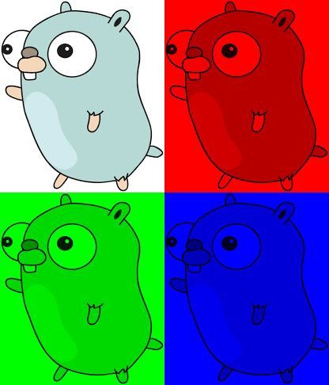

# Img
Package img provides basic image manipulation for RGBA and Grayscale images in Golang.  
  



## Install
Assuming you have a go installation up and running:

> go get github.com/thewraven/img

## Quickstart

```go
package main

import (
    "image/jpeg"
    "github.com/thewraven/img"
    "os"
)

func main() {
    file, _ := os.Open("purple_flower_peter_harrison.jpg")
    jpegImage, _ := jpeg.Decode(file)
    defer file.Close()
    //Create an RGBA image from a image.Image
    colorImage := img.NewColorFromImage(jpegImage)
    //Split channels from image
    justRed := img.Red(colorImage)
    justGreen := img.Green(colorImage)
    //Merge two images into one
    justYellow := img.Add(justRed, justGreen)

    maxx := colorImage.Bounds().Max.X - 1
    midx := maxx / 2

    //Split image vertically
    halfYellow := justYellow.WithCols(0, midx)
    halfGreen := justGreen.WithCols(midx, maxx)

    //Join two images (It's chainable!)
    resultImage := halfYellow.ConcatRight(halfGreen)

    //Save the image
    newImg, _ := os.Create("result.jpg")
    defer newImg.Close()
    jpeg.Encode(newImg, resultImage, &jpeg.Options{Quality: 80})
}
```

### Result
 Peter Harrison")

## Documentation
See [Godoc](https://godoc.org/github.com/thewraven/img)

## License
This project is licenced under the [GPLv3 License](LICENSE)
